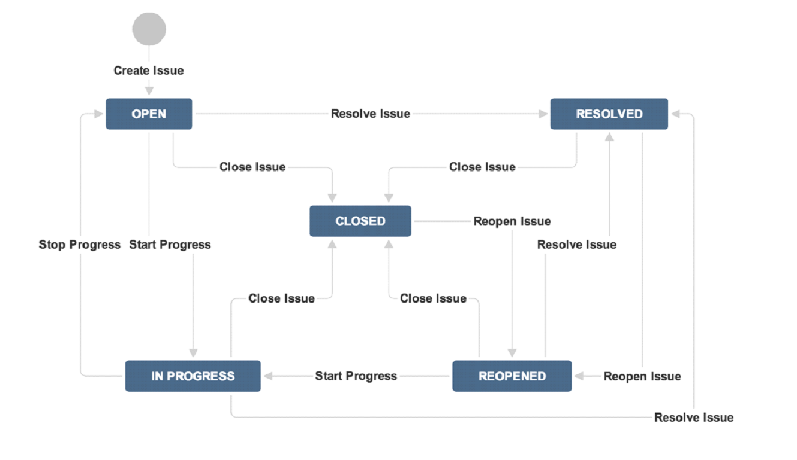

# Issue Tracking System – AngularJS Practical Project

You are assigned to design and implement an **issue tracker system**. The system holds **projects**, which have **issues**. Each **project** has a **leader** (the person responsible for the project), **name**, **description**, a **project key** (which should be generated by the client using the rule which is described below in the endpoints section), a set of **priorities** which the project’s issues can use and some **labels**.

Each **Issue** has a **title**, **description**, **issue key** (which is automatically generated by the system), an **assignee** (the person responsible to resolve the issue), a status which must follow a specific **status transition** (more on that below), a **due date**, a **priority** (which is some of the available priorities for the project), some **labels** and user-made **comments**.

A **status transition scheme** describes the workflow of an issue. See the image below for an example scheme:
 
 
 
A logged in user can view the **dashboard**, which depending of his role, will consist of different elements. All users can view the assigned **issues** to them, ordered by **due date** in descending order. **Administrators** can also create or edit issues and projects. 

The **project leader** can edit the project, add new issues to it and change the status of the current ones. The **issue assignee** has privileges to change the status of the issue.

Anonymous site visitors can only **login** and **register**. Logged in users can **logout**. You are given the server-side REST services to be called by your app with AJAX requests so you do not need to develop back-end.

##	Issue Tracker SPA Application
Design and implement a client-side SPA application based on AngularJS.

## Backend Endpoints

### Projects

###### [GET] Projects/
*	**Purpose**: Gets all projects
*	**Security**: Logged in

###### [GET] Projects/{id}
*	**Purpose**: Gets a project by id
*	**Security**: Logged in 

###### [POST] Projects/
*	**Purpose**: Adds a new project with a default transition scheme which holds these statuses: Open, Closed, In Progress, Closed Progress
*	**Security**: Admin
*	**Body parameters**:
   *	Name (Required)
   *	Description (Required)
   *	ProjectKey (Required): Should be generated by the first letters of the name. (Example: Project.Name = “Java Fundamentals” => Project.ProjectKey should be “JF”
   *	List<Labels>: A list of labels which will be added to the project
   *	List<Priorities>: A list of priorities which the project’s issues will be able to use
   *	LeadId: The id of the person who will be leading the project 
* **Returns**: The newly created project

###### [PUT] Projects/{id}
* 	**Purpose**: Edits a project by a given id
*	**Security**: Admin, Lead of project
*	**Body parameters**:
   *	Same as [POST] Projects/, except for ProjectKey which cannot be edited 
*	**Returns**: The edited project

### Issues

###### [GET] Projects/{id}/Issues
*	**Purpose**: Gets the project’s issues by id
*	**Security**: Logged in 
*	**Returns**: The project’s issues with their available statuses

###### [GET] Issues/?pageSize={pageSize}&pageNumber={pageNumber}&{filter}={value}
*	**Purpose**: Gets issues by a given filter
*	**Security**: Logged In
*	**Url parameters**: 
   *	filter (String): the filters which you want the issues to be filtered by
      *	Supports every issue’s property with equals, less (or equal) than, greater (or equal) than comparators (for example “ProjectId == 2”, “DueDate.Day >= 20”)
      *	Supports child properties (as seen above: “DueDate.Day < 10”, “Project.Name” == “SIT”)
      *	Supports multiple criterias using “and” and “or” in between them (for example “Priority.Name == "In Progress" or DueDate.Month == 3”)
   *	pageSize (Int, Required): how many elements do you want the system to return
   *	pageNumber (Int, Required): from which page to start (take the first pageSize * pageNumber elements)
*	**Returns**: The issues with their available statuses

###### [GET] Issues/me?pageSize={pageSize}&pageNumber={pageNumber}&orderBy={by}
*	**Purpose**: Gets the user’s currently assigned issues ordered by a given criteria
*	**Security**: Logged in
*	**Url parameters**:
   *	orderBy (String): the property of the issue which you want the issues to be sorted by
      *	Supports all issue’s properties (for example Project, IssueKey, DueDate)
      *	Supports child properties (for example Project.Name will sort the issues by the name of their project)
      *	Supports descending sorting, just add “desc” after the property (for example “IssueKey desc”)
      *	Supports multiple criteria using comma separated syntax (for example “Project.Name desc, IssueKey, Priority.Name desc”)
   *	pageSize (Int, Required): how many elements do you want the system to return
   *	pageNumber (Int, Required): from which page to start (take the first pageSize * pageNumber elements)
*	**Returns**: The user’s issues with their available statuses

###### [GET] Issues/{id}
*	**Purpose**: Gets an issue by id
*	**Security**: Logged in
*	**Returns**: The requested issue with its available statuses

###### [POST] Issues/
*	**Purpose**: Adds a new issue
*	**Security**: Admin, Project lead
*	**Body parameters**:
   *	Title (String, Required)
   *	Description (String, Required)
   *	DueDate (DateTime, Required)
   *	ProjectId (Int, Required): The issue’s project
   *	AssigneeId (String, Required): The issue’s assignee 
   *	PriorityId (Int, Required): The priority’s id (should be one of the available priorities for the project)
   *	List<Label> (Required): A list of labels for the issue
*	**Returns**: The newly created issue

###### [PUT] Issues/{id}
*	**Purpose**: Edits an issue by an id 
*	**Security**: Admin, Project lead
*	**Body parameters**: Same as [POST] Issues/, except for ProjectId which cannot be edited
*	**Returns**: The edited issue

###### [PUT] Issues/{id}/changestatus?statusid={statusId}
*	**Purpose**: Edits an issue’s current status, only if it’s available in the status transition scheme (for example, you can’t change the status from ‘Open’ directly to ‘Stopped Progress’)
*	**Security**: Admin, Issue assignee, Project lead
*	**Url Parameters**: 
   *	statusid (Int, Required): the id of the new status 
*	**Returns**: The new available statuses

###### [GET] Issues/{id}/comments
*	**Purpose**: Gets all the issue’s comments by a specified id
*	**Security**: Logged in

###### [PUT] Issues/{id}/comments
*	**Purpose**: Adds a new comment to an issue specified by id 
*	**Security**: Logged in user who is either a project leader or has a assigned issue in this project
*	**Body parameters**: 
   *	Text (String, Required): The comment’s text
*	**Returns**: list of all the issue’s comments

### Labels

###### [GET] Labels/?filter={filter}
*	**Purpose**: Gets all of the existing labels filtered
*	**Security**: Logged in 
*	**Returns**: The labels with their id and name
*	**Url Parameters**: 
   *	filter (String, Required): The starting substring for the searched labels (For example: “?filter=sof” can return “Softuni, software” and every existing label that starts with “sof”)

### Users

###### [POST] api/Account/Register
*	**Purpose**: Registers a new, non-admin, user to the system
*	**Security**: None
*	**Body parameters**:
   *	Email (String, Required): The email for the newly registered user
   *	Password (String, Required): Password
   *	ConfirmPassword: The same password for confirmation
*	**Returns**: Status code 200 on success

###### [POST] api/Token
*	**Purpose**: Gets an authentication token from the system to later authenticate the user (client) with the requests he makes
*	**Security**: None
*	**Body parameters**:
   *	Username (String, Required): Use the user’s email as it serves as the username in the system
   *	Password (String, Required): Password
   *	grant_type (String, Required): Should be always “password” in order to authenticate successfully
*	**Returns**: Data with a field access_token which is the necessary token needed for authentication
*	**Usage**: After getting the token you can authenticate every request made by the client by putting an “Authorization” key in the request headers with value: “Bearer {access_token}” where {access_token} is the one returned from the system.

###### [GET] Users/
*	**Purpose**: Gets all of the registered users
*	**Security**: Logged in 
*	**Returns**: The users with their id, username and whether they’re admin

###### [GET] Users/me
*	**Purpose**: Gets the currently 
*	**Security**: Logged in 
*	**Returns**: The user with his id, username and whether they’re admin

###### [PUT] Users/makeadmin
*	**Purpose**: Grants an user admin privileges
*	**Security**: Admin 
*	**Returns**: Status code 200 on success
*	**Body parameters**: 
   *	UserId (String, Required): The id of the user to be made admin

###### [POST] api/Account/Register
*	**Purpose**: Registers a new, non-admin, user to the system
*	**Security**: None
*	**Body parameters**:
   *	Email (String, Required): The email for the newly registered user
   *	Password (String, Required): Password
   *	ConfirmPassword: The same password for confirmation
*	**Returns**: Status code 200 on success

###### [POST] api/Account/ChangePassword
*	**Purpose**: Changes the current user’s password
*	**Security**: Logged in
*	**Body parameters**:
   *	OldPassword (String, Required): The user’s current password
   *	NewPassword (String, Required): New Password
   *	ConfirmPassword (String, Required): Again the new password for confirmation
*	**Returns**: Status code 200 on success

## Project Requirements

### Public Screens
Public screens are accessible for site visitors without login.

######	Login Screen
*	Route: **#/login**
*	**Logins an existing user**. Shows notification for success or error message.
*	After login, the user is automatically redirected to the dashboard.

######	Register User Screen
*	Route: **#/register**
*	**Registers a new user**. Shows notification for success or error message.
*	After registration, the user is automatically logged in and is redirected to the dashboard.

### User Screens	
User screens are accessible for authorized users only (after login).

######	User Dashboard
*	Route: **#/**
*	Includes the user’s assigned issues, ordered by due date in descending order and a panel with all the projects that you are associated with (you have an assigned issue in them or you are a project leader)

######	Project Page
*	Route: **#/projects/:id**
*	Includes all the project info and all of its issues. If the user is the project’s leader he can add new issues.
*	Make it so by default the user is showed only his assigned issues. 
*	Create a filter to see all issues or specific ones based on different criterias (be creative).

######	Edit Project Page
*	Route: **#/projects/:id/edit**
*	If the user is the project leader, he can access this page and edit the project.

######	Add Issue 
*	Route: **#/projects/:id/add-issue**
*	A modal dialog with a form for creating a new issue. The form consists of:
   *	Assignee (Drop-down with all available users)
   *	Project (Drop-down with all available projects)
   *	Due (Calendar)
   *	Priority (Drop-down with available priorities for this project)
   *	Label (Text-box which suggests already created labels by typing a substring. If the label does not exist – creates it)
   *	Title (Text-box)
   *	Description (Textarea)
   *	Create Issue (Button)

######	Issue page
*	Route: **#/issues/:id**
*	Displays the information about the issue
*	If the user is the assignee, they can see a button for changing the status using an available status (e.g. Open -> Closed).
*	If the user is the issue’s project leader they can see the edit issue button.
*	View the issue’s comments.
*	Additional field for adding comments if you are affiliated with this project (you have an issue assigned in the project or you’re the project’s leader).

######	Edit Issue page
*	Route: **#/issues/:id/edit**
*	The page is not visible unless the user is the issue’s project leader or assignee. 
*	If the user is the assignee, they can change the status using an available status (e.g. Open -> Closed).
*	If they are the project’s leader they can edit the whole issue (including its assignee).

######	Change User Password
*	Route: **#/profile/password**
*	Users should be able to change their password from form (contains old password, new password and confirm new password). Show notification for success or error message.

######	Logout
*	Route: **#/logout**
*	Successfully logged in users should be able to logout from the app.
*	Logout shows a notification message and redirects to the Home screen.

######	Guest Authorization Checks
*	Anonymous site visitors (without login) should be able to access only Login and Register screens.
*	An attempt to access anonymously these screens should redirect the user to the Home screen.

### Administrator Screens	
Administrator screens are accessible for authorized users only (after login).
	
######	User Dashboard
*	Route: **#/**
*	Same as the normal user’s dashboard. Includes two buttons for adding a new project and listing all projects.

######	Projects
*	Route: **#/projects**
*	Lists all projects
*	Each project has the ability to be edited and an issue to be added to it.

######	Add Project 
*	Route: **#/projects/add**
*	A modal dialog with a form for creating a new project. The form consists of:
   *	Leader (Drop-down with all available users)
   *	Project Key (Text-box)
   *	Priorities (Text-box)
   *	Label (Text-box, which suggests already created labels by typing a substring. If the label does not exist – creates it)
   *	Name (Text-box)
   *	Description (Textarea)
   *	Create Project (Button)

######	Edit Project Page
*	Route: **#/projects/:id/edit**
*	All of the functionality as the project’s leader including the ability to change the leader.
